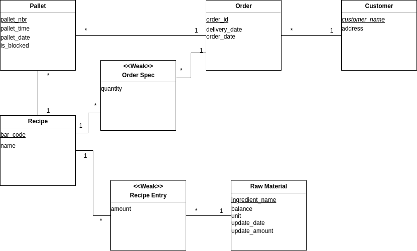

#EDAF75 Database Project

Relations:

+ recipes(\_bar_code\_, name)
+ customers(\_customer_name\_, address)
+ raw_materials(\_ingredient_name\_, balance, unit, update_date, update_amount)
+ recipe_entries(amount, *\_bar_code\_*, *\_ingredient_name\_*)
+ orders(\_order_id\_, order_date, delivery_date, *\_customer_name\_*)
+ pallets(\_pallet_nbr\_, *\_bar_code\_*, pallet_time, pallet_date, is_blocked, *\_order_id\_*)
+ order_spec(*\_bar_code\_*, *\_order_id\_*, quantity)

[Link to the repository](https://github.com/VilhelmA/EDAF75_Project)
